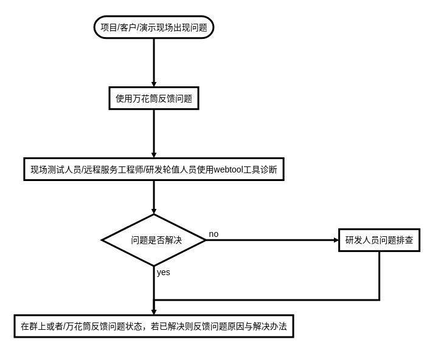

# 无人车指南 :)
-----------
## 目录
- [现场问题反馈流程指南](#现场问题反馈流程指南)
- [导航错误码查阅](#错误码)
    - [PNCxxxxE-决策规划错误码](#决策规划错误码)
    - [CONTROLxxxxE-控制错误码](#控制错误码)
    - [PERCEPTxxxxE-感知错误码](#感知错误代码)
    - [SAFETYxxxE-安全错误码](#安全错误码)
    - [LOCATExxxxE-定位错误码](#定位错误码)
    - [MAPxxxxE-地图错误码](#地图错误码)
    - [MISSIONxxxE-任务错误码](#任务错误码)
    - [SYSTEMxxxxE-系统错误码](#系统错误码)
    - [SENSORxxxxE-传感器错误码](#传感器错误码)
    - [DOCKxxxxE-装卸错误码](#装卸错误码)
- [嵌入式小面板错误码](#嵌入式小面板错误码)
- [其他现场问题处理](#其他现场问题处理)
    - [清扫模块](#清扫模块)
    - [线路](#线路)
    - [声光提示](#声光提示)
    - [装卸箱](#装卸箱)
    - [充电](#充电)
    - [结构](#结构)
    - [车轮](#车轮)
    - [顶升](#顶升)
    - [遥控器](#遥控器)
    - [大屏幕](#大屏幕)
    - [电池](#电池)
    - [导航](#导航)
- [遥控器使用说明](#遥控器使用说明)
- [安全用车注意事项](#安全用车注意事项)

-----------
# 现场问题反馈流程指南

# 错误码查阅
## 决策规划错误码
|错误码|错误信息|解决方法|
|-|-|-|
|PNC0001E|路径规划时间过久|查看环境是否拥堵-->是否卡在虚拟墙-->检查传感器状况-->@决策规划组成员|
|PNC0002E|规划目标点有障碍|查看目标点是否有虚拟墙或障碍物--> 调整点位 --> @决策规划组成员|
|PNC0003E|非标准清扫区域|@绘图组人员检测清扫区域的边是否自身相交|
|PNC0004E|路径搜索失败|查看目标点是否有虚拟墙或障碍物--> 环境是否拥堵 --> 目标点是否非法 --> @决策规划组成员 |
## 控制错误码
## 感知错误码
## 安全错误码
## 定位错误码
## 地图错误码
## 任务错误码
## 系统错误码
## 传感器错误码
## 装卸错误码
# 嵌入式小面板错误码
# 其他现场问题处理
## 清扫模块
## 线路
## 声光提示
## 装卸箱
## 充电
## 结构
## 车轮
## 顶升
## 遥控器
## 大屏幕
## 电池
## 导航

# 遥控器使用说明
# 安全用车注意事项